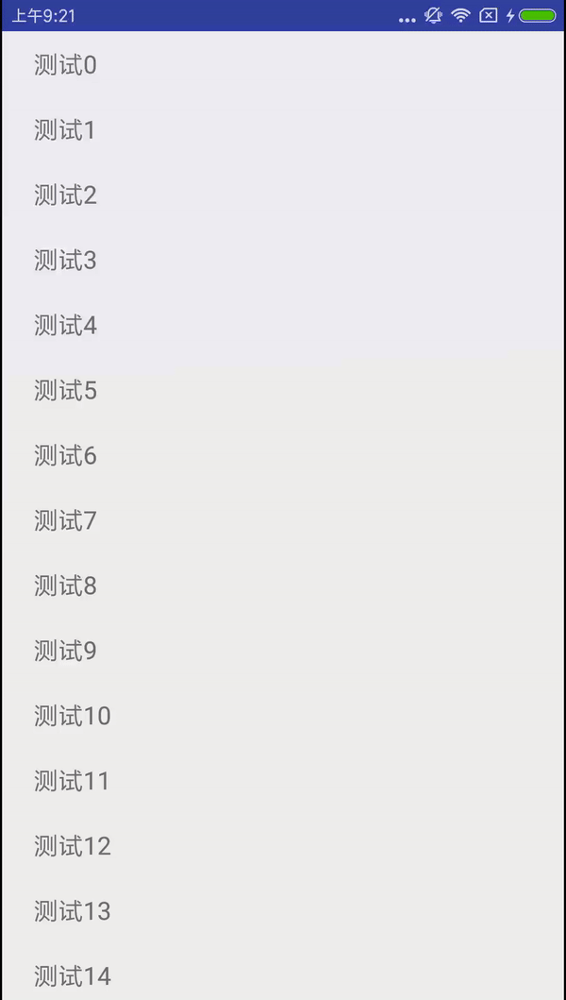
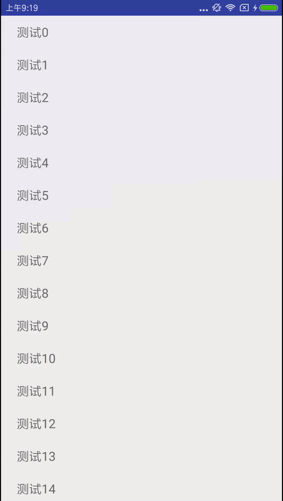

# screenshot
<a href="pic/maituan.gif" width="40%"/></a> <a href="pic/normal.gif"></a>
<a href="pic/normal.gif"></a> <a href="pic/maituan.gif"></a>
## 
Step 1. Add the JitPack repository to your build file</br>
Add it in your root build.gradle at the end of repositories:</br>
```Java
	allprojects {
		repositories {
			...
			maven { url 'https://jitpack.io' }
		}
	}
```
```Java
Step 2. Add the dependency

	dependencies {
	        compile 'com.github.yanjiabin:DDPullToRefresh-master:v1.0'
	}
```
#### in your xml
```java
	<?xml version="1.0" encoding="utf-8"?>
	<com.yanjiubin.pulltorefreshlibrary.RefreshLayout
	    android:id="@+id/refresh_layout"
	    xmlns:android="http://schemas.android.com/apk/res/android"
	    xmlns:tools="http://schemas.android.com/tools"
	    android:layout_width="match_parent"
	    android:layout_height="match_parent">

	    <!-- 当然这里我使用的是recyecleview -->
	    <android.support.v7.widget.RecyclerView
		android:id="@+id/recycleview"
		android:layout_width="match_parent"
		android:layout_height="match_parent"/>

	</com.yanjiubin.pulltorefreshlibrary.RefreshLayout>

```
```Java
	 refreshLayout = (RefreshLayout) findViewById(R.id.refresh_layout);
		mRecyclerView = (RecyclerView) findViewById(R.id.recycleview);
		mRecyclerView.setLayoutManager(new LinearLayoutManager(this));
		mRecyclerView.setNestedScrollingEnabled(false);
		mAdapter = new TextAdapter();
		mRecyclerView.setAdapter(mAdapter);
		//美团的效果就是new MeiTuanSelfHeaderViewManager(this)，基本的下拉效果new NormalSelfHeaderViewManager(this)
		refreshLayout.setSelfHeaderViewManager(new MeiTuanSelfHeaderViewManager(this));
		pageLimitDelegate.attach(refreshLayout, mRecyclerView, mAdapter); //pageLimitDelegate  这个是一个分页管理类
		
		
```
####  需要注意的是
这里的上拉加载我使用的是 BaseRecyclerViewAdapterHelper 这个库,个人感觉挺不错的,我开发的项目中也都是用的这个库,挺实用的,推荐给大家.
recycleView 搭配BaseRecyclerViewAdapterHelper可以基本上可以解决所有的列表展示.下拉刷新的和上拉加载的逻辑都封装在了pageLimitDelegate这个分页管理类中,  我们只需要请求数据的类 implements PageLimitDelegate.DataProvider 就行了 然后在重写的 loadData(int page) 中去请求数据.
